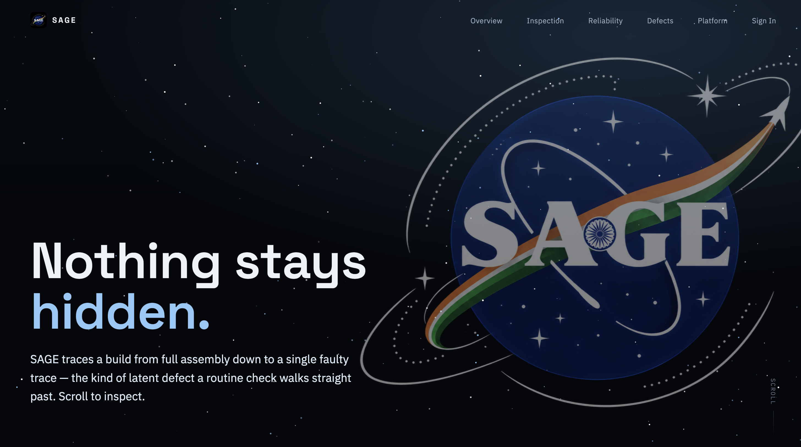
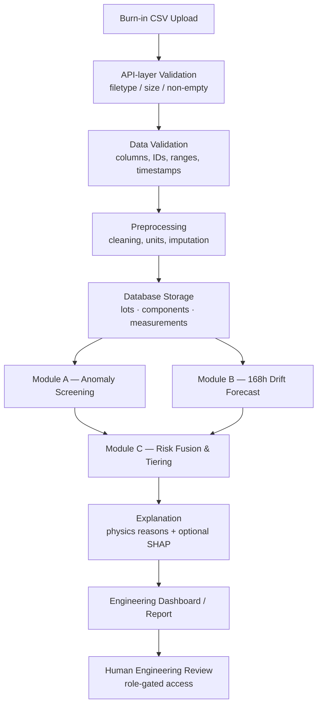
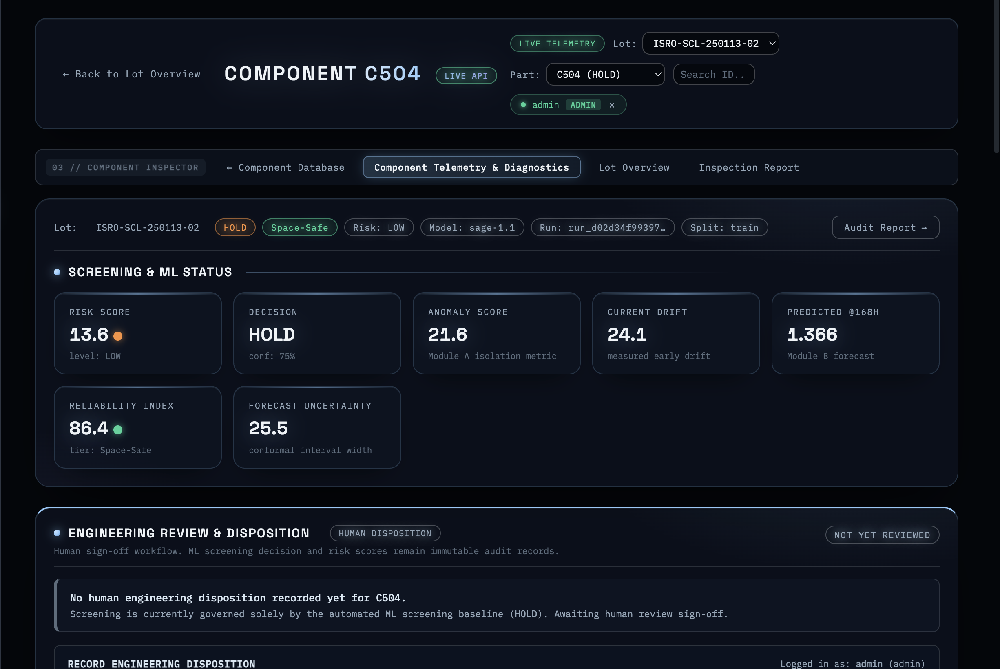
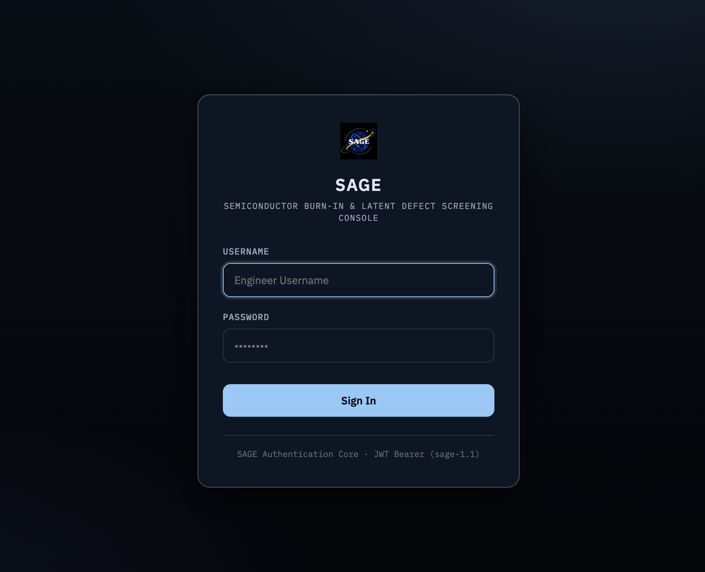
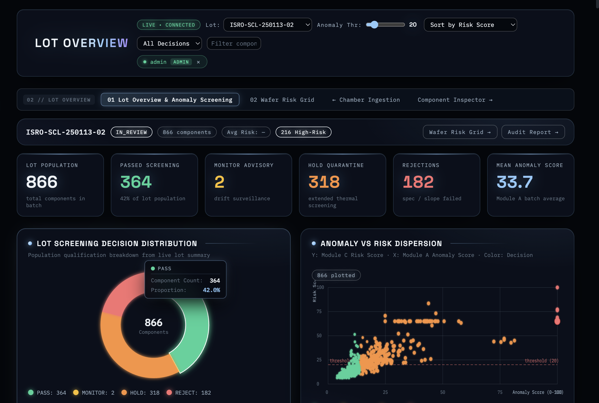
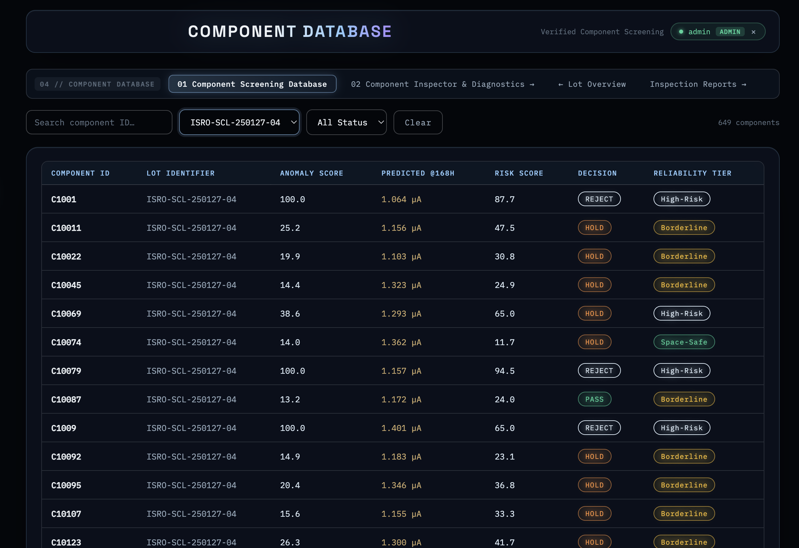
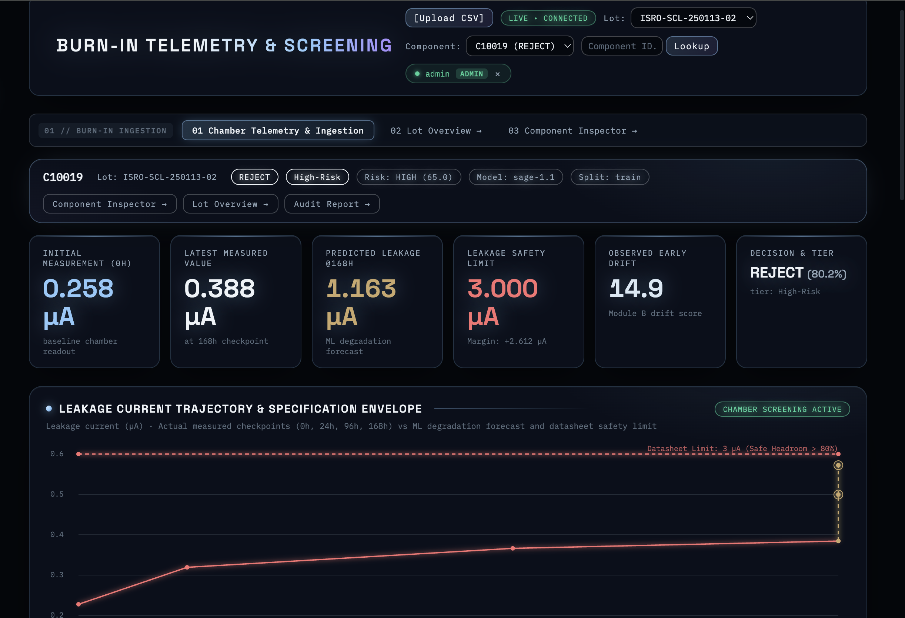
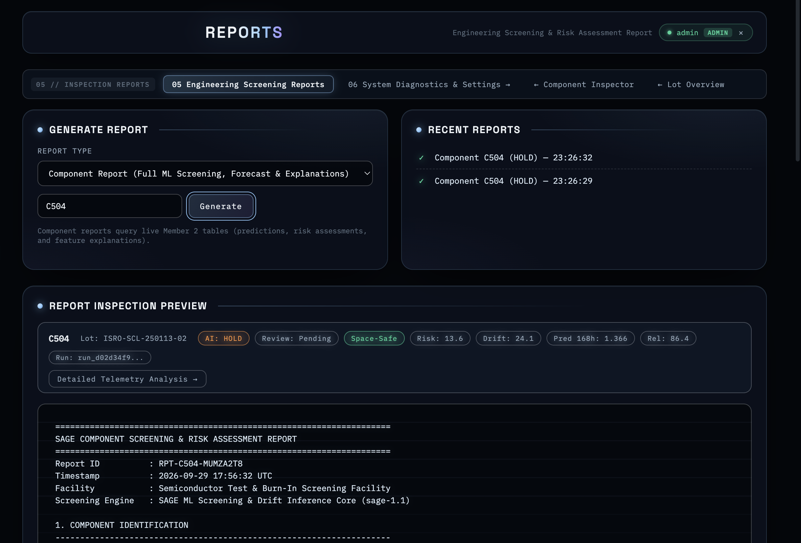
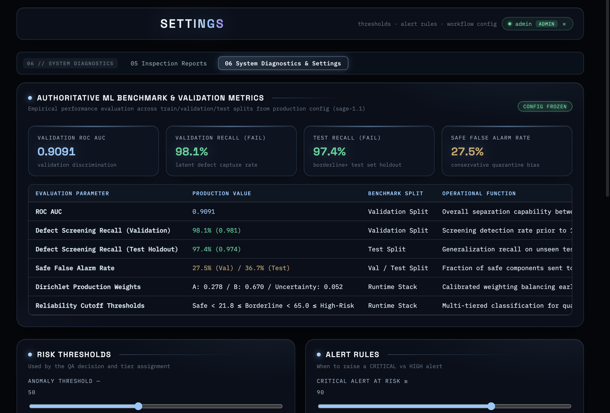

<p align="center">
  
</p>

<p align="center">
  
</p>

<h1 align="center">SAGE</h1>
<h3 align="center">Semiconductor Burn-In & Latent Defect Screening Console</h3>

<p align="center">
  AI-assisted multi-parameter anomaly detection and risk-prioritisation for burn-in test data —
  flags components a simple PASS/FAIL threshold check would miss, so engineers can investigate earlier.
</p>

<p align="center">
  <b>Smart India Hackathon 2026</b> · Team <b>BINARY BADDIES</b>
</p>

<p align="center">
  
  
  
  
</p>

> ⚠️ **SAGE is a decision-support / early-screening tool.** It does not replace qualification
> testing, certification, engineering judgement, or existing safety procedures — it exists to
> surface components worth a closer look, sooner.

---

## Table of Contents
1. [Problem Statement](#1-problem-statement)
2. [Our Solution](#2-our-solution)
3. [Key Features](#3-key-features)
4. [System Workflow](#4-system-workflow)
5. [AI / ML Architecture](#5-ai--ml-architecture)
6. [Explainability](#6-explainability)
7. [Human Engineering Review](#7-human-engineering-review)
8. [Security](#8-security)
9. [Screenshots / Demo](#9-screenshots--demo)
10. [Example Component Journey](#10-example-component-journey)
11. [Tech Stack](#11-tech-stack)
12. [Project Structure](#12-project-structure)
13. [Local Setup](#13-local-setup)
14. [Testing](#14-testing)
15. [Limitations](#15-limitations)
16. [Future Scope](#16-future-scope)
17. [Hackathon Impact](#17-hackathon-impact)
18. [Team](#18-team)

---

## 1. Problem Statement

Burn-in testing stresses electronic components (thermal, radiation, or cycling stress) and
measures how key electrical parameters — **Leakage current, Resistance, Threshold voltage
(Vth)** — move over time. The industry-standard approach is a **pass/fail threshold check**:
if a parameter stays inside its spec limit at the final checkpoint, the component passes.

That approach has a blind spot: a component can stay *inside* spec at every checkpoint while
still drifting faster than its peers, showing an unusual multi-parameter pattern, or trending
toward a limit it hasn't crossed yet. These are **latent defects** — problems a single-point
threshold check won't catch, but that matter for components destined for high-reliability or
space-grade applications where field failures are expensive or impossible to service.

SAGE targets exactly this gap: multi-parameter anomaly detection, drift forecasting, and
risk prioritisation on top of (not instead of) the traditional PASS/FAIL result — with the
explanation an engineer needs to trust or challenge the call, and a workflow where a human
still makes the final disposition.

## 2. Our Solution

SAGE takes raw burn-in measurement data and turns it into a **prioritised, explained risk
picture**:

```
Burn-in CSV → validation → database → anomaly screening → drift forecast
            → risk fusion → explanation → engineering report/dashboard
```

At every stage, the AI output is framed as **screening support**, not a verdict: a risk score,
a tier (Space-Safe / Borderline / High-Risk), and a list of reasons are produced for a human to
review — the system does not (and is not designed to) auto-reject a component without that
context being available to an engineer.

## 3. Key Features

Verified against the current codebase:

- **CSV burn-in data ingestion** — upload endpoint with filetype/size/emptiness/malformed-CSV
  validation (`POST /api/burnin/upload`)
- **Lot & component management** — lots and components are modeled as first-class entities
  with a full relational schema (see [§12](#12-project-structure))
- **Data-quality validation & preprocessing** — a dedicated pipeline (`database/validation.py`,
  `database/preprocessing.py`) checks columns, IDs, numeric ranges, and timestamps before
  anything is stored or scored
- **Multi-parameter anomaly detection** (Module A) — lot-relative scoring + per-part-type
  multivariate Isolation Forest + drift severity
- **168-hour drift forecasting** (Module B) — RF + Gradient Boosting models fused by a Ridge
  meta-learner, with quantile regressors for prediction intervals
- **Fused risk scoring & tiering** (Module C) — a weighted combination of anomaly, predicted
  drift, and forecast uncertainty, with hard floors for absolute spec failures and abnormal
  drift slopes
- **Explainability** — every screening call ships with human-readable *reasons*; optional
  SHAP-based per-feature attribution for flagged components
- **Human engineering disposition workflow** — engineers record a formal PASS / HOLD /
  QUARANTINE call with rationale on top of the AI decision, with an append-only review history
  per component (confirmed live — see [§7](#7-human-engineering-review) for a note on source
  verification)
- **JWT authentication with role-based access** — `admin` / `engineer` / `reviewer` roles;
  writes (uploads, dispositions) are restricted, reads are open to all authenticated roles
- **Component trajectory & engineering reports** — actual vs. predicted burn-in curves and a
  full explainability report per component, generated on demand
- **Configurable risk & alert thresholds** — anomaly/drift thresholds and critical-alert
  triggers are adjustable from a System Diagnostics settings panel, alongside live model
  validation benchmarks (ROC AUC, recall, false-alarm rate)
- **Alerts feed** — high-risk components surfaced for attention
- **Single-service deployment** — FastAPI serves both the API and the static dashboard from one
  process/URL

## 4. System Workflow



## 5. AI / ML Architecture

SAGE's inference stack is a fitted, artifact-based 3-module pipeline (`backend/database/ml_inference.py`),
trained in the notebooks under [`notebooks/`](notebooks/) on a 10,000-row synthetic burn-in
dataset (20 lots; part types MOSFET, Op-Amp IC, Voltage Regulator IC, Digital Logic IC; stress
types Thermal-High, Radiation-Low, Cycling-Medium — generated by
[`scripts/generate_burn_in_dataset.py`](scripts/generate_burn_in_dataset.py), see
[Limitations](#15-limitations)).

#### Module A — Anomaly Screening (`anomaly_detection.ipynb`)
- **Lot-relative scoring**: robust (MAD-based) z-scores against each component's own lot
- **Multivariate scoring**: one Isolation Forest per part type (falls back to a global model for
  groups under 30 rows)
- **Drift severity**: early-checkpoint drift signal
- **Absolute spec check**: components that fail the traditional threshold test are floored to a
  minimum risk score regardless of the ML score
- **Deterministic fallback**: if the fitted artifact can't be loaded, the system degrades to a
  pure statistical scorer (lot z-score + linear slope extrapolation) so ingestion never hard-fails

#### Module B — Drift Prediction (`drift_prediction.ipynb`)
- Forecasts Leakage, Resistance, and Vth to the **168-hour checkpoint**
- Model: tuned **Random Forest** + **multi-output Gradient Boosting**, fused by a **Ridge
  meta-learner**, with separate **quantile regressors (α = 0.05 / 0.95)** for the prediction
  interval
- **Uncertainty score** = 0.6 × aleatoric (interval width) + 0.4 × epistemic (RF/GB disagreement)
- **Safety-slope flag**: if a component's predicted drift *rate* exceeds the 99th-percentile
  rate measured on Safe training components, it's flagged for early rejection independent of
  the risk score

#### Module C — Risk Assessment (`reliability_index.ipynb`)
Fused risk score, exactly as tuned in the notebook and read from
[`backend/models/config.json`](backend/models/config.json):

```
Risk = 0.278 × Anomaly_Risk_Score
     + 0.670 × Predicted_Drift_Score
     + 0.052 × Uncertainty_Score
```
then floored to **≥ 65** if the component failed the absolute spec check *or* tripped the
safety-slope flag, and clipped to [0, 100].

| Tier | Risk score | Maps to `risk_level` |
|---|---|---|
| Space-Safe | < 21.8 | LOW |
| Borderline | 21.8 – 65.0 | MEDIUM |
| High-Risk | ≥ 65.0 | HIGH |

These weights and cut-offs were found by a 500-draw Dirichlet search on the validation split,
targeting ≥ 98% recall on validation "Fail" cases (achieved: 98.1% val recall, 90.9% val AUC,
97.4% test recall at Borderline+, 36.7% test false-alarm rate on Safe — per `config.json`).
**Note from the config's own tuning log**: the REJECT decision threshold in Module A landed at
a saturated value, so in practice HOLD is the top decision the pipeline outputs — worth knowing
before a judge notices it.

## 6. Explainability

Every component report includes a `reasons` list — plain-language explanations such as "Strong
deviation from lot baseline" or "Predicted trajectory crosses safety envelope" — generated from
the same signals that drove the risk score (absolute spec failure, safety-slope trip, predicted
drift, forecast uncertainty).

For components flagged **Borderline** or **High-Risk**, SAGE can additionally compute **SHAP
(SHapley Additive exPlanations)** top-feature attributions for both the anomaly and drift
models, stored as `shap_top_features` and surfaced via the `explanations` field on the
component report. This is **off by default** (the anomaly explainer runs at ~1.3s/row) and is
enabled per-ingestion with `python -m database ingest <csv> --explain N`, capped at N rows.

**What this is not**: SHAP attributions and the physics-based reasons explain *what the model
weighted*, not a proven physical root cause. The distinction between "the model flagged this
because of X" and "X is confirmed to be the physical cause of failure" is the engineer's
judgement to make, not the system's claim.

## 7. Human Engineering Review

SAGE is built around a human-in-the-loop principle. Confirmed live in the deployed console
(**Component Inspector** page, "Engineering Review & Disposition" panel):

- Every AI decision (`PASS` / `MONITOR` / `HOLD` / `REJECT`), its risk score, decision
  confidence, and reliability tier are shown to the reviewing engineer alongside the component's
  full telemetry — nothing is hidden.
- The AI screening decision is explicitly described in the UI as an **immutable audit record**
  ("ML screening decision and risk scores remain immutable audit records"), kept separate from
  the human call.
- Engineers can record a formal **disposition** — `PASS` (cleared for flight batch), `HOLD`
  (re-test/bake), or `QUARANTINE` (isolation/reject) — with a free-text rationale (up to 1000
  chars), via a "Submit Disposition" action.
- Until a human acts, the component is explicitly labeled **"NOT YET REVIEWED"** and the panel
  states "Screening is currently governed solely by the automated ML screening baseline" —
  the AI output is not treated as final on its own.
- An **append-only review history** is shown per component (`APPEND-ONLY REVIEW HISTORY (0)`
  in the screenshot below, for a component with no review yet).
- **Role-based access control** gates who can act: `reviewer` accounts are read-only (writes
  return `403 Forbidden`); `engineer` and `admin` accounts can submit dispositions and trigger
  new ingestions.

<p align="center">
  
</p>

> **Note on verification**: this workflow is confirmed by direct inspection of the *live
> deployed console*, not by reading its backend source — the disposition/review-history code
> was not present in the repository export this README was originally built from. If your
> repo's `main` branch doesn't yet contain this feature, sync it before submitting so the
> README matches what judges will find in the codebase, not just the live demo.

## 8. Security

Implemented in `backend/app/security.py` and `backend/app/main.py`:

- **JWT authentication** (HS256, PyJWT) — short-lived access tokens (default 60 min) + longer
  refresh tokens (default 7 days) with rotation on every refresh
- **Every `/api/*` route is protected by default** via a FastAPI middleware (fail-closed: a new
  router is protected automatically, not opt-in) — only `/api/auth/login`, `/api/auth/refresh`,
  and `/api/auth/logout` are public
- **Role-based access control** — three roles (`admin`, `engineer`, `reviewer`); write methods
  (`POST`/`PUT`/`PATCH`/`DELETE`) are rejected with `403` for the `reviewer` role at the
  middleware level, independent of any single endpoint's own logic
- **Password handling** — bcrypt hashing (with SHA-256 pre-hash for inputs over bcrypt's 72-byte
  limit), constant-time comparison, no plaintext passwords stored in application logic paths
- **Login rate limiting** — 5 failed attempts / 5 minutes per client IP, in-memory
- **Timing-attack mitigation** — a dummy bcrypt hash is computed on unknown usernames so login
  response time doesn't reveal which usernames exist
- **Generic error responses** — a single "Invalid or expired token" message covers expired,
  tampered, and malformed tokens so nothing is disclosed about *why* a token failed
- **CORS** — explicit origin allow-list via `ALLOWED_ORIGINS` (env var), `allow_credentials`
  correctly left off (the wildcard-origin + credentials combination is invalid per the CORS
  spec and was fixed)
- **No secrets in source** — `SAGE_JWT_SECRET`, `SAGE_USERS` etc. are read from environment
  variables; `.env` is git-ignored and `.env.example` ships as the template
- **Generic 500 handler** — unhandled exceptions are logged server-side but never leak stack
  traces or internals to the client

## 9. Screenshots / Demo

Live deployment: **<https://sage-app-f8hc.onrender.com/app>** *(Render free tier — may take
~50s to wake up on first request)*

<p align="center">
  
</p>
<p align="center"><i>The six-module platform, as presented on the landing page</i></p>

<p align="center">
  
</p>
<p align="center"><i>JWT-authenticated sign-in (SAGE Authentication Core · sage-1.1)</i></p>

<p align="center">
  
</p>
<p align="center"><i>Lot Overview — population-level PASS/MONITOR/HOLD/REJECT breakdown and an anomaly-vs-risk scatter</i></p>

<p align="center">
  
</p>
<p align="center"><i>Component Inspector — screening status, ML metrics, and the human disposition workflow</i></p>

<p align="center">
  
</p>
<p align="center"><i>Component Database — searchable inventory across lots, decisions, and reliability tiers</i></p>

<p align="center">
  
</p>
<p align="center"><i>Burn-In Ingestion — measured vs predicted leakage trajectory against the datasheet safety limit</i></p>

<p align="center">
  
</p>
<p align="center"><i>Inspection Reports — auto-generated component screening & risk assessment report</i></p>

<p align="center">
  
</p>
<p align="center"><i>System Diagnostics — live ROC AUC / recall benchmarks and configurable risk & alert thresholds</i></p>

The repository's `Frontend/assets/` folder also contains **marketing/scroll-animation frame
sequences** (rocket, satellite, and component "explode" animations — ~722 JPEG frames total)
used by the public landing page's scroll-driven reveal — separate from the application
screenshots above.

## 10. Example Component Journey

Using the actual field/terminology from the codebase:

```
Component (e.g. C104, Part_Type = MOSFET)
   → Measurements recorded at 0h / 24h / 96h / 168h
     (Leakage, Resistance, Vth, under a Proxy_Stress e.g. "Thermal-High")
   → Data Validation & Preprocessing
   → Module A: Anomaly_Risk_Score computed (lot-relative + multivariate + drift severity)
   → Module B: 168h trajectory forecast + Predicted_Drift_Score + Uncertainty_Score
   → Module C: fused risk_score, reliability_tier (e.g. "High-Risk"), decision (e.g. "REJECT")
   → Explanation: reasons[] generated (e.g. "Predicted trajectory crosses safety envelope")
   → Engineering Report available via GET /api/components/C104/report
   → Reviewed by an authenticated engineer/admin in the console
```

(This mirrors the real example in the repo's original documentation: component `C104` scoring
`risk_score: 87.0`, decision `REJECT`, with reasons including strong lot-baseline deviation,
high early drift, and a predicted trajectory crossing the safety envelope.)

## 11. Tech Stack

| Layer | Technology |
|---|---|
| Backend framework | FastAPI 0.141, Uvicorn |
| Language | Python 3.13 |
| Data validation | Pydantic v2 |
| Database ORM | SQLAlchemy 2.0 |
| Database | SQLite (default, file-based) or PostgreSQL (via `psycopg[binary]`, `DATABASE_URL`) |
| ML / data processing | scikit-learn (1.6.x, pinned), pandas, numpy, joblib |
| Explainability | SHAP (optional dependency) |
| Authentication | PyJWT (HS256), bcrypt |
| Frontend | Static HTML/CSS/JavaScript (no framework, no build step) |
| Testing | pytest, httpx |
| Containerization | Docker, docker-compose |
| Deployment | Render (Blueprint via `render.yaml`), also documented for Railway/Fly.io |

## 12. Project Structure

```
SAGE_2026/
├── Frontend/                    # Static HTML/CSS/JS dashboard
│   ├── index.html               # Public landing page (scroll animation)
│   ├── pages/                   # Authenticated console pages
│   │   ├── components.html / component-detail.html
│   │   ├── lot-analytics.html / lot-detail.html
│   │   ├── anomaly.html / predictions.html / trends.html
│   │   ├── burn-in.html / reports.html / settings.html
│   ├── auth.js                  # JWT session handling, token refresh
│   ├── api.js                   # Centralized API client
│   └── assets/                  # Scroll-animation frame sequences
│
├── backend/
│   ├── app/
│   │   ├── main.py              # FastAPI app, CORS, JWT middleware, router registration
│   │   ├── security.py          # JWT + RBAC + rate limiting
│   │   ├── api/                 # Routers: auth, health, upload, lots, components, alerts
│   │   ├── schemas/              # Pydantic request/response models
│   │   └── services/             # Business logic (DB-backed, falls back to mock_data.py)
│   ├── database/
│   │   ├── models.py            # ORM: lots, components, measurements, predictions,
│   │   │                         #      risk_assessments, explanations
│   │   ├── validation.py        # Pre-storage data-quality checks
│   │   ├── preprocessing.py     # Cleaning, units, imputation
│   │   ├── ml_inference.py      # Modules A/B/C inference + explainability
│   │   ├── crud.py              # DB queries + report-data preparation
│   │   ├── ingestion.py         # CSV → validate → preprocess → store → infer
│   │   └── __main__.py          # CLI: init | drop | ingest | validate | stats | stack
│   ├── models/                  # Fitted ML artifacts (.joblib) + config.json + metadata.json
│   ├── data/                    # Bundled burn-in dataset + generated split/results CSVs
│   ├── tests/                   # 104 pytest tests across API, DB, and ML-inference layers
│   └── requirements.txt
│
├── notebooks/                    # Model training notebooks (source of the /models artifacts)
│   ├── anomaly_detection.ipynb
│   ├── drift_prediction.ipynb
│   └── reliability_index.ipynb
├── scripts/generate_burn_in_dataset.py   # Synthetic dataset generator
├── Dockerfile / docker-compose.yml / render.yaml
└── DEPLOYMENT.md
```

## 13. Local Setup

**Requirements**: Python 3.13 (backend pinned to scikit-learn 1.6.x — see note in
`requirements.txt`).

```bash
cd backend
python -m venv venv

# Windows
venv\Scripts\activate
# macOS/Linux
source venv/bin/activate

pip install -r requirements.txt
```

Set up environment variables:

```bash
cp .env.example .env
```

At minimum, set a real JWT secret and at least one user before logging in:

```bash
# .env
SAGE_JWT_SECRET=<generate with: python -c "import secrets; print(secrets.token_urlsafe(48))">
SAGE_USERS=admin:yourpassword:admin,engineer1:pass2:engineer,reviewer1:pass3:reviewer
```

**Never commit a real `.env` file** — it's git-ignored; `.env.example` is the template only.

Initialize the database and load the bundled dataset (optional — the app falls back to demo
data if you skip this):

```bash
python -m database init
python -m database ingest data/burn_in_dataset.csv
```

Run the API:

```bash
uvicorn app.main:app --reload
```

- Dashboard: <http://127.0.0.1:8000/app>
- API docs (Swagger): <http://127.0.0.1:8000/docs>
- Health check: <http://127.0.0.1:8000/health>

**Docker (alternative)**:

```bash
SAGE_JWT_SECRET=$(python -c "import secrets; print(secrets.token_urlsafe(48))") \
SAGE_AUTH_PASSWORD=yourpassword \
docker compose up --build
```

## 14. Testing

```bash
cd backend
pip install -r requirements.txt   # includes pytest + httpx
pytest -v
```

**104 tests** across 11 files, covering:

| Area | File | Tests |
|---|---|---|
| Auth (login, refresh, RBAC, rate limiting) | `test_auth.py` | 27 |
| Database CRUD | `test_database_crud.py` | 14 |
| Lots API | `test_lots.py` | 11 |
| Components API | `test_components.py` | 10 |
| Data validation | `test_database_validation.py` | 10 |
| ML inference | `test_model_inference.py` | 9 |
| Upload endpoint | `test_upload.py` | 9 |
| Preprocessing | `test_database_preprocessing.py` | 6 |
| Ingestion | `test_database_ingestion.py` | 5 |
| Health | `test_health.py` | 2 |
| Alerts | `test_alerts.py` | 1 |

Database-layer tests run against an in-memory SQLite instance; API-contract tests run against
the mock service layer — no live PostgreSQL is required in CI.

## 15. Limitations

Stated plainly, as evident from the implementation:

- **Synthetic dataset**: the bundled 10,000-row burn-in dataset is generated
  (`scripts/generate_burn_in_dataset.py`), not from real component testing. Model performance
  numbers (§5) are validation/test metrics on this synthetic data, not a claim of real-world
  accuracy.
- **No persisted human-review audit trail — confirmed present as of the live deployment**
  (§7): earlier drafts of this README (based on an older repo export) flagged this as missing.
  It's live now; make sure your submitted repo's `main` branch actually contains this code
  before judging, since the export used to write most of this README did not have it.
- **REJECT threshold saturation**: per the model's own tuning notes, the REJECT decision
  threshold in Module A landed at a saturated value on the validation set, so HOLD is
  effectively the top decision the current model produces.
- **Explainability is opt-in and budget-limited**: SHAP attribution is off by default and, when
  enabled, is capped to a configurable number of flagged rows per ingestion for performance
  reasons.
- **Free-tier deployment caveats**: on Render's free plan there's no persistent disk (SQLite
  resets on redeploy — the app falls back to demo data), and the service sleeps after 15 minutes
  of inactivity (first request after sleep takes ~50s).
- **Single-node rate limiting**: login rate limiting is in-process memory, not shared across
  multiple server instances.
- **No screenshots of the working application** currently exist in the repo (see §9).

## 16. Future Scope

Realistic next steps, clearly not yet implemented:

- Real-world burn-in datasets to validate the model stack beyond synthetic data
- Expanded part-type and stress-condition coverage
- Model monitoring / drift-of-the-model-itself detection in production
- Richer engineering analytics and lot-level trend dashboards
- Production-grade deployment (persistent database, horizontal scaling, distributed rate
  limiting)
- Broader automated explainability (SHAP enabled by default once performance allows)

## 17. Hackathon Impact

SAGE combines several pieces that are each individually common, but less often integrated end
to end in a hackathon timeframe: a real multi-module ML pipeline (anomaly detection + time-series
drift forecasting + a tuned risk-fusion layer), explainability that a non-ML engineer can read,
role-gated security suitable for a multi-person engineering team, and full test coverage (104
tests) across the API, database, and inference layers — all served as one deployable unit from a
single FastAPI process.

## 18. Team

**BINARY BADDIES** — Smart India Hackathon 2026

*(Individual member names were not found in the repository; add them here if you'd like them
credited.)*

---

## Assets Required

To complete this README for a hackathon submission, the following are referenced or recommended
but not currently present in the repository:

- Screenshots of the live dashboard, login page, component detail, predictions, and reports
  views (see [§9](#9-screenshots--demo))
- Individual team member names (only the team name "BINARY BADDIES" was found in code comments)

## Missing / Unverifiable Information

The following could not be confirmed from the repository and may need to be supplied manually:

- **Problem statement ID / SIH track** — the repo confirms "Smart India Hackathon 2026" and
  team name. The `ISRO-SCL` fab code in the dataset generator, plus the Indian tricolor +
  Ashoka Chakra worked into the live app's logo, point fairly strongly at a space/ISRO-related
  problem statement — but no text in the repo or live site explicitly names ISRO as a partner
  or problem-statement owner, so treat this as "visually implied," not confirmed. Fill in the
  actual problem-statement ID/number if you have it.
- **Live demo URL** — `DEPLOYMENT.md` documents the Render deployment process but no live URL
  was found committed in the repo.
- **Real-world validation status** — none claimed or found; treated as not yet done (§15).

